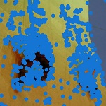

## Attend and Guide (AG-Net): A Keypoints-driven Attention-based Deep Network for Image Recognition 
**Asish Bera, Zachary Wharton, Yonghuai Liu, Nik Bessis, and Ardhendu Behera**<br/>
**Department of Computer Science, Edge Hill University, United Kingdom**

### Abstract
Deep Convolutional Neural Networks (CNNs) for recognizing images with distinctive classes have shown great success, but their performance in discriminating fine-grained changes is not at the same level. We address this by proposing an end-to-end CNN model, which learns meaningful features linking fine-grained changes using our novel attention mechanism. It captures the spatial structures in images by identifying semantic regions (SRs) and their spatial distributions, and is proved to be the key to modeling subtle changes in images. We automatically identify these SRs by grouping the detected keypoints in a given image. The “usefulness” of these SRs for image recognition is measured using our innovative attentional mechanism focusing on parts of the image that are most relevant to a given task. This framework applies to traditional and fine-grained image recognition tasks and does not require manually annotated regions (e.g. bounding-box of body parts, objects, etc.) for learning and prediction. Moreover, the proposed keypoints-driven attention mechanism can be easily integrated into the existing CNN models. The framework is evaluated on six diverse benchmark datasets. The model outperforms the state-of-the-art approaches by a considerable margin using Distracted Driver V1 (Acc: 3.39%), Distracted Driver V2 (Acc: 6.58%), Stanford-40 Actions (mAP: 2.15%), People Playing Musical Instruments (mAP: 16.05%), Food-101 (Acc: 6.30%) and Caltech-256 (Acc: 2.59%) datasets.

### Attend and Guide (AG-Net)
A novel method for generating sematic regions by loacalizing salient keypoints and grouping them using the Gaussian Mixture Model (GMM). These semantic regions are aimed to attain local to global contextual information involving smaller patches to larger patches to the whole image. Our AG-Net is trained in an end-to-end fashion to recognize images from these semantic regions be _learning to attend_ each region by its importance towards classification decision using a novel attention module. 

<p align="center">
&nbsp;&nbsp;</p>

**Proposed keypoint-driven attention-based visual recognition model (AG-Net): (a) Used for recognizing different fine-grained activities in still images (e.g., the input image is classified as driving safely activity). (b) Detailed Self-Attention block adapted from SAGAN. (c) The proposed residual connection to the Squeeze-and-Excitation block is used for pooling features from semantic regions.**

<p align="center">
  &nbsp;&nbsp;&nbsp;&nbsp;&nbsp;&nbsp;&nbsp;&nbsp;</p>  

**Climbing action from Stanford-40 dataset: Original image &#8594; detected SIFT keypoints &#8594; clustered keypoints &#8594; bounding boxes enclosing semantic regions. Drinking image from AUC-V2 datasetr: Original image &#8594; detected two primary semantic regions (red and green) &#8594;  secondary semantic regions (blue) along with the
primary ones.**

  &nbsp;

**Bold** and _Italic_ and `Code` text

[Link](url) and 
```

For more details see [GitHub Flavored Markdown](https://guides.github.com/features/mastering-markdown/).

### Jekyll Themes

Your Pages site will use the layout and styles from the Jekyll theme you have selected in your [repository settings](https://github.com/ArdhenduBehera/ag-net/settings/pages). The name of this theme is saved in the Jekyll `_config.yml` configuration file.

### Support or Contact

Having trouble with Pages? Check out our [documentation](https://docs.github.com/categories/github-pages-basics/) or [contact support](https://support.github.com/contact) and we’ll help you sort it out.
